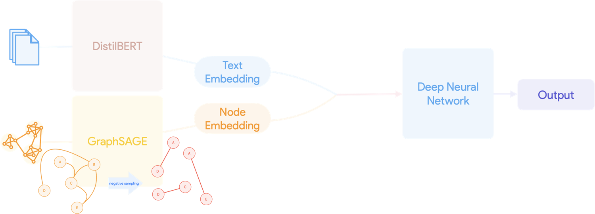

# Social Hate Speech Classifier

This project aims to classify hate speech text in Persian using both text and social structure information. It consists of three models: text_model, network_model, and social_hate_classifier.

## Text Model

The text model uses DistilBERT to embed the text using a pre-trained multilingual model from HuggingFace. It also uses a sequence classification layer to train and test the model on a dataset of Persian comments with hate speech labels. The text model extracts the features from the text embeddings using the base model and saves them as a new column in the train and test data frames.

## Network Model

The network model uses GraphSAGE to embed the social structure of users using their number of followers, number of texts, and follower index. It also uses a contrastive loss function to learn the embeddings from positive and negative edges. The network model saves the embeddings as a new column in the train and test matrix data frames.

## Social Hate Speech Classifier

The social hate speech classifier concatenates the text and graph features in a vector of 784 dimensions. It also uses a fully connected neural network with three layers to get the result. It uses a cross-entropy loss function and an Adam optimizer to train the model on the train set. It evaluates the model on the test set using accuracy, precision, recall, and F-score metrics.

## Requirements

To run this project, you need to install the following libraries and frameworks:

- numpy
- pandas
- torch
- torch_geometric
- transformers
- sklearn

You can use pip or conda to install them.

## Note

This project is a simplified version of the model used for my thesis. I used AI to clean my code and generate this README file.
